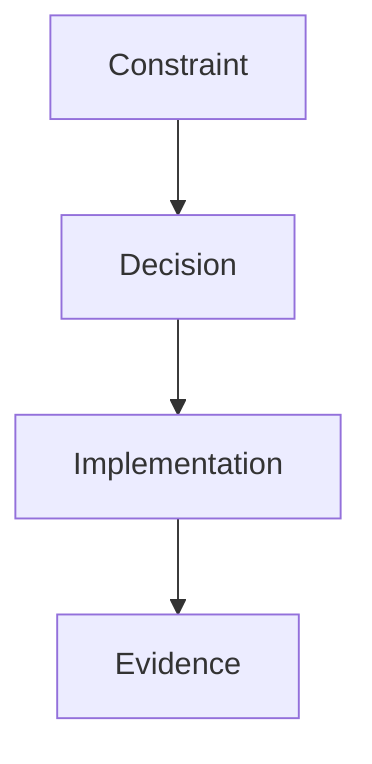

# 0000: Decision Title

## Status
Proposed

## Context
What problem are we solving? What constraints exist?

## Decision
Describe the chosen approach.

## Alternatives Considered
- Option A
- Option B

## Consequences
- Positive
- Negative
- Risks

## Validation / Evidence
- Commands run:
  - `example command`
- Output summary:
  - `example output`

## Diagram (Optional but encouraged)

