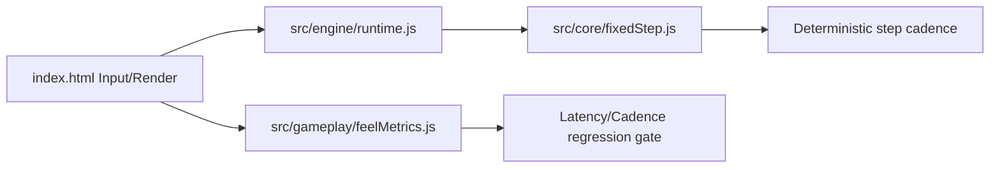

# 0001: Phase 1 Fixed-Step Runtime Seam in `src/`

## Status
Accepted

## Context
Phase 1 now requires minute-1 feel hardening and a minimal engine base in `src/` before broad feature expansion. The playable prototype remains in `index.html`, but deterministic responsiveness checks and fixed-step boundaries are needed immediately.

## Decision
Create a minimal runtime seam across:
- `src/core/fixedStep.js` for fixed-step simulation advancement and runtime loop hosting.
- `src/engine/runtime.js` for engine-level loop composition.
- `src/gameplay/feelMetrics.js` for latency/cadence instrumentation and regression evaluation.

Wire `index.html` to run through the new runtime seam and surface feel regression status in HUD.

## Alternatives Considered
- Keep all loop and metrics logic inline in `index.html`.
- Delay all runtime extraction until Phase 7.

## Consequences
- Positive: Phase 1 gains deterministic simulation skeleton and measurable feel gating.
- Positive: Phase 7 maturation has a concrete seed runtime to evolve instead of rewriting.
- Risk: Temporary dual mode (inline game logic + modular runtime seam) until deeper modularization phases.

## Validation / Evidence
- Commands run:
  - `node scripts/bench/phase1_feel_check.js`
- Output summary:
  - Deterministic feel metrics print and regression gate returns PASS.

## Diagram (Optional but encouraged)

