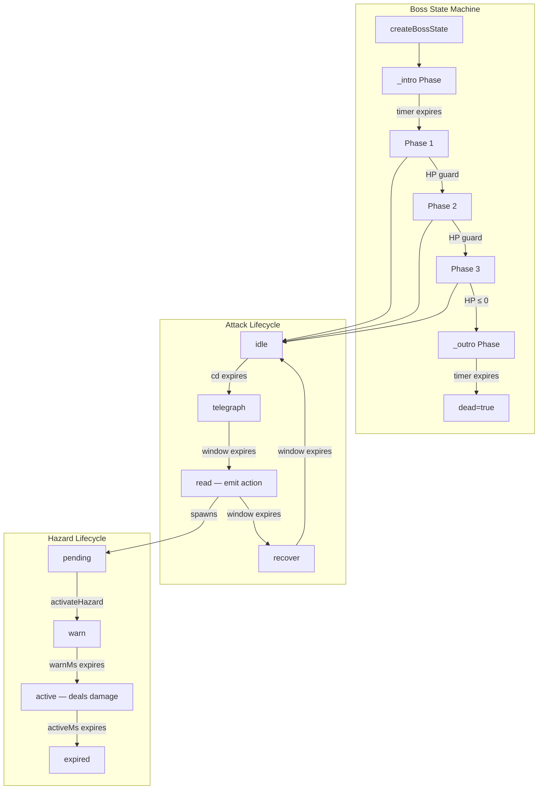

# 0002: Phase 3 — Deterministic Boss State Machines

## Status
Accepted

## Context
Phase 3 requires bosses modeled as deterministic phase state machines with explicit
transition guards (health thresholds, timers, triggers). The prior implementation
had inline boss behavior in `index.html` with basic `if (e.hp < threshold)` checks —
no cinematic transitions, no hazard system, no replay capability.

Key requirements:
- Three bosses: Shepherd, Pit, Choir (new)
- Attack lifecycle matching Phase 2 enemy contracts (telegraph → read → recover)
- Hazard system (arena confinement, damage sigils, collapsing zones)
- Intro/outro cinematics with input locks
- Deterministic record/replay for tuning
- Full testability in Node.js (no DOM dependency)

## Decision
Implemented a modular boss framework across three new modules plus updates to
existing code:

| Module | Purpose |
|--------|---------|
| `src/gameplay/bossStateMachine.js` | Phase machine + 3 boss definitions |
| `src/gameplay/bossHazards.js` | Hazard lifecycle (pending→warn→active→expired) |
| `src/gameplay/bossReplay.js` | Deterministic record/replay |
| `src/presentation/entityVisuals.js` | Choir rendering + hazard/phase-flash visuals |
| `index.html` | Wiring: boss spawn, update, events, render, debug overlay |

### Architecture

### Boss Definitions

| Boss | Floor | Phases | Phase Transitions | Key Mechanics |
|------|-------|--------|-------------------|---------------|
| Shepherd | 0 | 2 | HP<50% | Phase 1: chase + summon penitents; Phase 2: 1.5× speed + 8-way radial |
| Choir | 2 | 3 | HP<60%, HP<30% | Orbit + damage sigils → faster + 4-way shots → collapsing zones + 6-way |
| Pit | 3 | 3 | HP<66%, HP<33% | Delayed mirror + aimed shots → faster shots → arena confinement |

### Debug/Tuning

- **F6 key**: Boss debug overlay showing phase, HP, hazard count, attack states
- **Replay system**: Record per-tick inputs, replay deterministically, extract stats

## Alternatives Considered
- **Inline behavior only**: Simple but untestable, no cinematics, no replay.
- **External FSM library**: Unnecessary dependency; our bosses need domain-specific
  attack lifecycle + hazard integration that a generic FSM doesn't provide.
- **Single monolithic boss module**: Would work but harder to test hazards and
  replay independently.

## Consequences
- **Positive**: All boss behavior is deterministic and testable without a browser.
  Phase transitions are explicit and observable. Replay enables data-driven tuning.
- **Positive**: Hazard system is reusable for future encounter design.
- **Negative**: Boss `update` runs outside the regular enemy loop (separate code path).
- **Risk**: Boss `hp`/`health` dual fields require sync (mitigated by `damageBoss` API).

## Validation / Evidence
- Commands run:
  - `node scripts/bench/phase3_boss_statemachine_check.js`
  - `node scripts/bench/phase3_boss_replay_check.js`
  - `node scripts/bench/phase1_feel_check.js` (regression check)
  - `node scripts/bench/phase2_enemy_contracts_check.js` (regression check)
- Output summary:
  - Boss state machine: 33 passed, 0 failed — PASS
  - Boss replay: 7 passed, 0 failed — PASS
  - Phase 1 feel: PASS (no regressions)
  - Phase 2 enemy contracts: PASS (no regressions)
