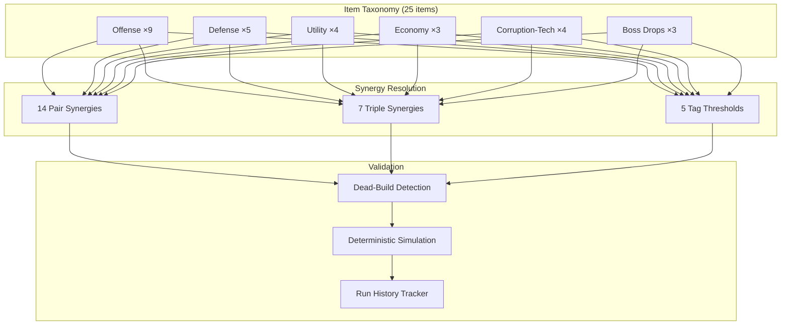

# 0003: Phase 4 — Item Taxonomy and Synergy System

## Status
Accepted

## Context
Phase 4 requires a concrete item taxonomy, synergy matrix, dead-build safeguards,
and deterministic simulation to guarantee build diversity without broken or no-op
outcomes. The prior implementation had a flat inline `itemPool` array in `index.html`
with ad-hoc stat modifiers and no synergy or validation logic.

Key requirements:
- 5-category item taxonomy (offense, defense, utility, economy, corruption-tech)
- Pair/triple synergy matrix with emergent behavior
- Anti-synergy and dead-build detection
- Run-history tracking for balance telemetry
- Deterministic N-run simulation for fairness validation
- Compatible with Phase 1 runtime seam (no DOM dependency in module)

## Decision
Implemented a data-driven item system in a single new module with integration
wiring in `index.html`:

| Module | Purpose |
|--------|---------|
| `src/gameplay/itemSystem.js` | Item definitions, synergies, simulation, run history |
| `scripts/bench/phase4_item_synergy_check.js` | 246-test validation suite |
| `index.html` | Altar/reliquary/boss-drop wiring, F7 overlay, combat hooks |
| `MEMORY.md` | Balance assumptions and policy documentation |

### Architecture



### Data-Driven Design

Items are defined as plain data objects (no closures or `apply` functions):
```js
{ id: "iron_tears", name: "IRON TEARS", category: "offense",
  tags: ["tear","body"], rarity: "common",
  effects: { damage: 0.3, tears: -0.2 },
  description: "Tears hit harder but fire slower" }
```

Effects are applied by a single `applyItemEffects` function that reads the
`effects` object and maps keys to player stats with balance-floor enforcement.

### Synergy Types

| Type | Count | Trigger | Example |
|------|-------|---------|---------|
| Pair | 14 | Hold exactly 2 specific items | OSSIFIED: flayed_skin + bone_ward → +15% DR, +0.2 dmg |
| Triple | 7 | Hold exactly 3 specific items | IRON LEECH: siphon_tooth + blood_chalice + flayed_skin → +0.5 siphon, +0.3 dmg |
| Tag | 5 | Hold 3+ items sharing a tag | UNHOLY COMMUNION: 3+ unholy → +0.3 dmg, +10 corruption |

### Balance Safeguards

- **Minimum floors**: DPS ≥ 1.0, soul ≥ 2, damage ≥ 0.5, tears ≥ 0.5
- **DR cap**: 75% maximum damage reduction
- **Dead-build detection**: Checks effective DPS (accounting for chain/split
  multipliers and corruption scaling), soul floor, and no-op item ratio
- **Category-diverse offerings**: Item generation ensures category variety
  and excludes already-held items

### Corruption Scaling

Items with corruption-tech tag gain scaling bonuses at high corruption:
- At 100% corruption: +50% damage, +30% tear rate
- Linearly interpolated between 0–100%

### Debug Overlay (F7)

Displays: DPS, damage, tears, corruption%, soul/max, DR%, viability,
held items list, active synergies with bonuses, corruption scaling preview,
and dead-build issue warnings.

## Alternatives Considered

- **Closure-based item effects**: Each item carries an `apply(player)` function.
  Rejected because closures break deterministic serialization, make testing
  harder, and prevent synergy inspection without execution.
- **Flat synergy lookup**: Single map of `[id,id] → bonus`. Would work for pairs
  but doesn't naturally extend to triples or tag-threshold scaling.
- **Separate synergy module**: Splitting synergies into their own file. Rejected
  because synergies are tightly coupled to item definitions and balance
  constants; splitting would create unnecessary cross-module coupling.

## Consequences

- **Positive**: All item behavior is data-driven, testable without a browser,
  and inspectable via the F7 overlay. Simulation proves 0 dead builds across
  1000 random runs.
- **Positive**: Synergy system is extensible — adding new pairs/triples/tags
  requires only new data entries, not new code.
- **Positive**: Run history tracking enables future balance telemetry (Phase 10).
- **Negative**: `recalcSynergyBonuses` resets and re-applies all items from
  scratch on every pickup, which is O(items × synergies) but negligible at
  current scale.
- **Risk**: Balance constants (damage floors, DR cap) may need tuning as
  content expands; documented in MEMORY.md for visibility.

## Validation / Evidence

- Commands run:
  - `node scripts/bench/phase4_item_synergy_check.js`
  - `node scripts/bench/phase1_feel_check.js` (regression check)
  - `node scripts/bench/phase2_enemy_contracts_check.js` (regression check)
  - `node scripts/bench/phase25_visual_readability_check.js` (regression check)
  - `node scripts/bench/phase3_boss_statemachine_check.js` (regression check)
  - `node scripts/bench/phase3_boss_replay_check.js` (regression check)
- Output summary:
  - Item synergy check: 246 passed, 0 failed — PASS
  - Dead-build simulation: 0/1000 dead builds — PASS
  - Phase 1 feel: PASS (no regressions)
  - Phase 2 enemy contracts: PASS (no regressions)
  - Phase 2.5 visual readability: PASS (no regressions)
  - Phase 3 boss state machines: PASS (no regressions)
  - Phase 3 boss replay: PASS (no regressions)
- Browser testing: Item pickup, synergy activation, overlay rendering, and
  corruption scaling verified via live gameplay and console evaluation.
