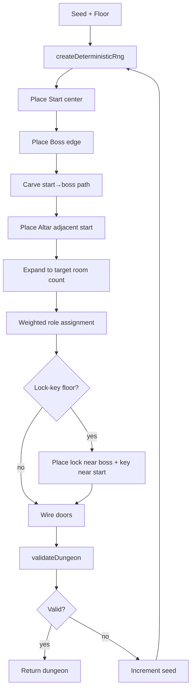

# 0004: Phase 6 — Deterministic Dungeon Generator with Validation

## Status
Accepted

## Context
The existing `createDungeon` function in `index.html` used `Math.random()`,
produced non-deterministic layouts, had no reachability enforcement, no
economy guarantees, and could create monotonous linear corridors. SPEC.md
requires a 5×5 grid with guaranteed start-to-boss path, start at center,
boss at edge, altar near start, and weighted room role assignment.

Phase 6 requirements:
- Weighted templates and lock-key progression.
- Pacing rules (intensity valleys/peaks).
- Minimum economy/recovery rooms per floor.
- Path entropy to prevent linear monotony.
- Generator validator with fail-fast reroll.
- No unwinnable seeds.

## Decision
Implement a fully deterministic, seeded dungeon generator as `src/gameplay/dungeonGenerator.js`
that uses the project's existing LCG RNG pattern. The generator produces layouts through a
sequence of constrained steps (start → boss → path → altar → expansion → role assignment →
lock-key), followed by a multi-constraint validator that either accepts or rejects the seed.
A reroll wrapper (`generateValidDungeon`) increments the seed until validation passes.

Key design choices:
1. **Deterministic LCG RNG** — same seed always produces the same dungeon.
2. **Constraint-first validation** — validator checks reachability, room counts, economy,
   entropy, pacing, lock-key consistency, and confession presence. All constraints are
   independently testable.
3. **Fail-fast reroll** — rejected seeds are logged and the generator tries the next seed.
   Hard failure after 100 attempts (never triggered in 4000-seed sweep).
4. **Floor-specific configs** — each floor has its own room count range, composition
   rules, and feature toggles (confession, lock-key).
5. **Pacing via intensity scoring** — each room type has a numeric intensity score.
   BFS traversal order produces an intensity profile; validation requires at least
   one recovery room between start and boss.

## Alternatives Considered
- **Template-based handcrafted layouts**: Higher design control but no run variety.
  Rejected — roguelite core loop requires procedural variety.
- **Wave Function Collapse (WFC)**: More sophisticated but complex to implement and
  harder to enforce specific constraints. Overkill for 5×5 grid.
- **Post-hoc fixing**: Generate freely and patch constraint violations. Rejected —
  harder to reason about invariants. Validator-reject-reroll is simpler.

## Consequences
- **Positive**: No unwinnable seeds verified across 4000 dungeons. Economy and pacing
  guarantees enforced. Lock-key gates add progression depth on later floors. Deterministic
  replay is preserved.
- **Negative**: Reroll attempts add slight overhead (max 60 observed, typical 1-3).
  Not meaningful for a per-floor generation call.
- **Risks**: Floor configs may need retuning as content expands. The `rest` room type
  is new and not yet visually/mechanically implemented in the prototype shell.

## Validation / Evidence

```
$ node scripts/bench/phase6_dungeon_gen_check.js

Phase 6 Dungeon Generation & Pacing
  PASSED: 105/105
  FAILED: 0/105

Mass sweep: 0 unwinnable seeds in 4000 dungeons (1000 seeds × 4 floors)
Max reroll attempts: 60

$ node scripts/bench/phase5_corruption_check.js
PASS: 169/169

$ node scripts/bench/phase4_item_synergy_check.js
RESULTS: 246 passed, 0 failed
```

## Diagram


