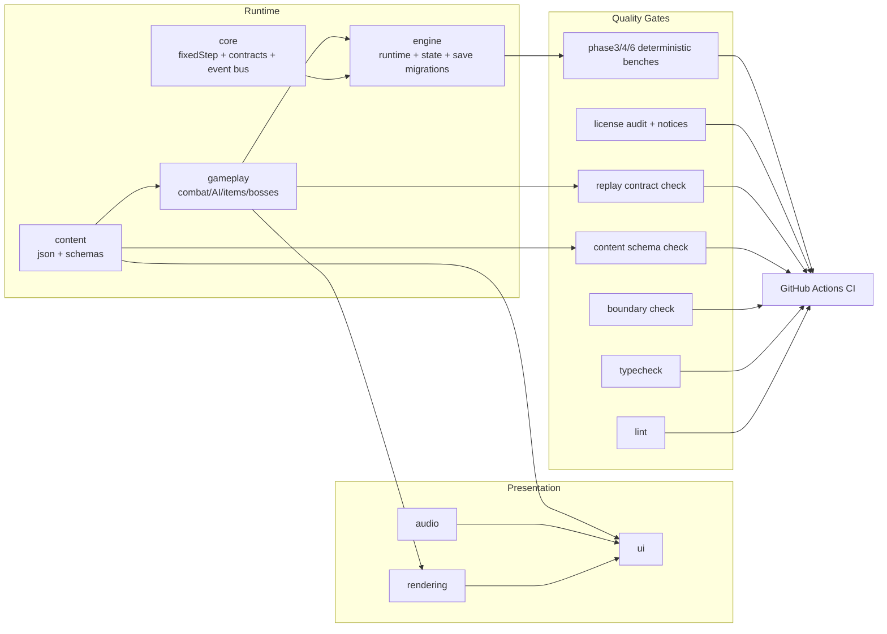

# 0005: Phase 7 - Layer Boundaries and Validation Toolchain

## Status

Accepted

## Context

Phase 7 requires maturing the early Phase 1+ `src/` seam into enforceable boundaries and adding reliable toolchain gates for deterministic regressions, content schema correctness, and dependency compliance.

Before this decision:

- The runtime seam existed (`src/core/fixedStep.js`, `src/engine/runtime.js`) but architecture was still mostly `core/gameplay/presentation`.
- There were no CI gates for lint/type/content-schema/boundary checks.
- Content definitions were mostly code-local and not schema-validated files.
- Dependency license auditing and notices generation were manual/non-existent.

## Decision

Adopt a strict, validated layer model and a script-driven quality gate pipeline.

### Layer model

- `core`: deterministic primitives (`fixedStep`, simulation contracts, event bus)
- `engine`: runtime orchestration, game-state contracts, save migrations
- `gameplay`: deterministic mechanics and state machines
- `content`: data definitions and schema contracts
- `rendering`: entity/hazard rendering helpers
- `audio`: audio contract parameters and cues
- `ui`: HUD/overlay rendering
- `presentation`: compatibility facade for incremental migration

### Boundary enforcement

- Add `scripts/validate/check_boundaries.js`.
- Enforce allowed layer dependencies and reject disallowed namespace/require usage.
- Keep `presentation` as a temporary compatibility layer while new boundaries become first-class.

### Content and schema pipeline

- Externalize baseline content files under `content/` (`items.json`, `enemies.json`, `rooms.json`).
- Add JSON schemas under `content/schemas/`.
- Validate via `scripts/validate/validate_content_schema.js`.

### Determinism and contract gates

- Add deterministic replay contract gate: `scripts/validate/replay_contract_check.js`.
- Keep existing deterministic phase checks in CI (`phase3`, `phase4`, `phase6`).
- Add simulation and state-transition contract modules in `src/core` and `src/engine`.

### Toolchain and CI

- Add `package.json` scripts for lint/type/boundary/content/replay/license checks.
- Add ESLint flat config and TypeScript contract-only checks (`types/content-contracts.ts`).
- Add GitHub Actions workflow `.github/workflows/ci.yml` with full gates.
- Add pre-commit hook `.husky/pre-commit` for local guardrails.

### License and notices enforcement

- Add `scripts/validate/license_audit.js` with permissive-license allowlist checks.
- Auto-generate/update `THIRD_PARTY_NOTICES.md` from direct dependencies.

## Alternatives Considered

- Keep soft/convention-only boundaries with no enforcement.
  - Rejected: allows silent architectural drift.
- Full ESM migration in one phase.
  - Rejected: high churn and regression risk for active prototype iteration.
- Type-check every runtime JS file immediately.
  - Rejected: disproportionate migration cost for current UMD-style prototype.

## Consequences

- Positive:
  - Boundary violations become CI failures rather than review-time surprises.
  - Content shape regressions are caught deterministically before merge.
  - Replay determinism and existing phase checks remain continuously enforced.
  - Dependency license policy is machine-checked and notices are reproducible.
- Negative:
  - Additional scripts/tooling maintenance overhead.
  - `presentation` compatibility layer is temporary duplication until full migration completes.

## Validation / Evidence

```bash
npm run lint
npm run typecheck
npm run check:boundaries
npm run check:content
npm run check:replay
npm run check:licenses
npm run check:phase3
npm run check:phase4
npm run check:phase6
```

## Diagram


