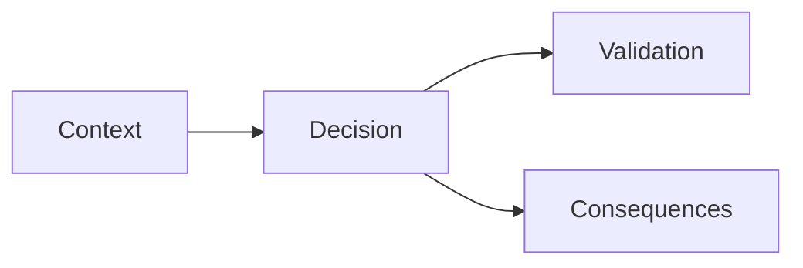

# Architecture Decisions (ADRs)

Store architecture decisions as markdown files in this folder.

## Naming

- Use incrementing IDs, e.g. `0001-simulation-model.md`, `0002-content-schema.md`.

## Required Sections

1. Status
2. Context
3. Decision
4. Alternatives Considered
5. Consequences
6. Validation/Evidence

## Mermaid Guidance

Use Mermaid diagrams where they improve clarity (state transitions, data flow, module boundaries, timelines).

